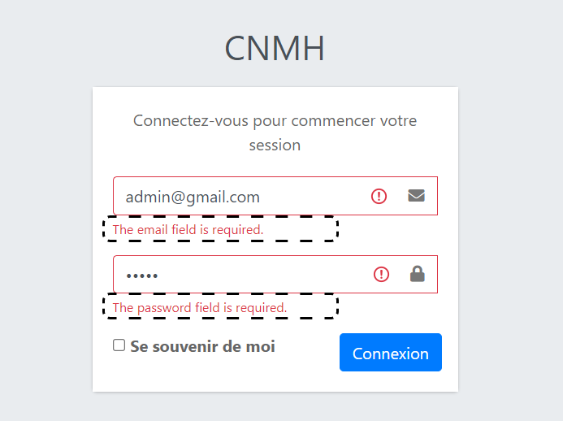
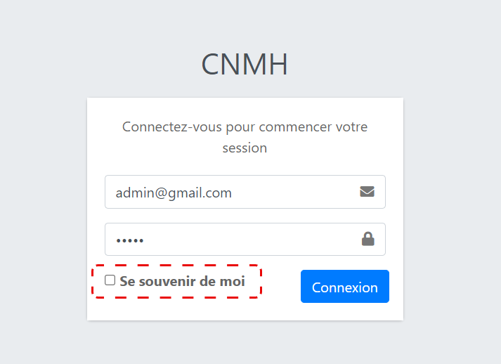

# CNMH test rapport 
## 1.   les fonctionnalités 
- admin connection
- social connection
- medecin connection

## 2.   Problem de resoudre

### admin connection

#### 1. Logo 

- Le titre `(CNMH)` devrait être supprimé et remplacé par le logo `CNMH`.

- En cliquant sur ce bouton, vous êtes redirigé vers cette page `(http://127.0.0.1:8000/home)`, qui affiche `(NOT FOUND)`.

#### 2. Informations qui apparaissent dans les champs de saisie

Les champs `input` doivent être vides au début du processus de connexion.

#### 3. Messages d'erreur

Les messages d'erreur doivent être rédigés en français.

#### 4. méthode `(de se souvenir de moi)`

La méthode de `de se souvenir de moi` ne fonctionne pas.

#### 5. Message error input password

Si la valeur de `l'input` du mot de passe est `incorrecte`, un message d'erreur apparaît dans la `input` de `l'e-mail`

