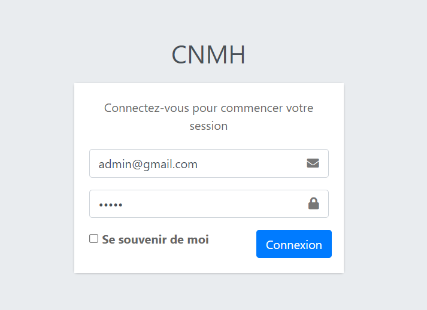
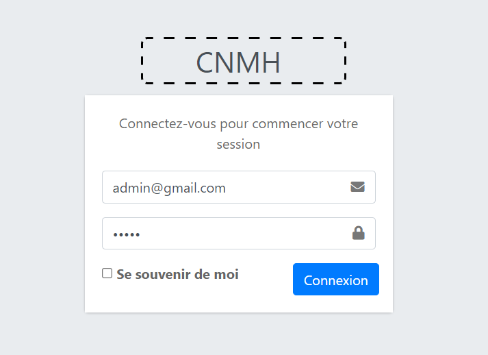
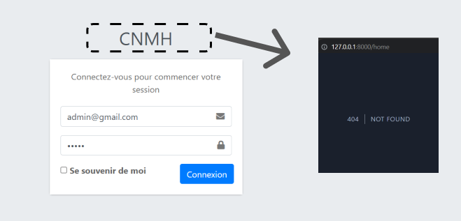
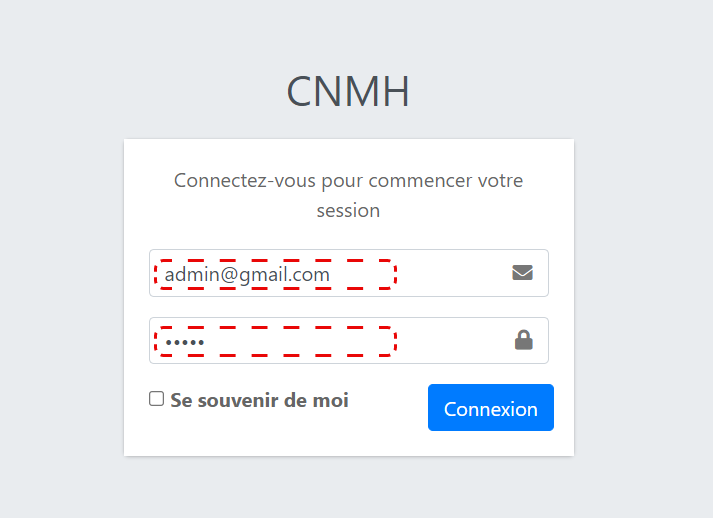
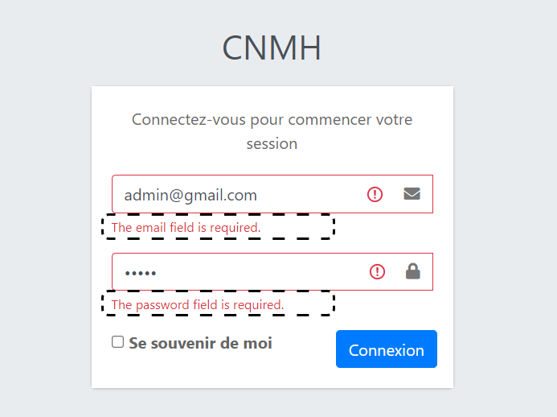
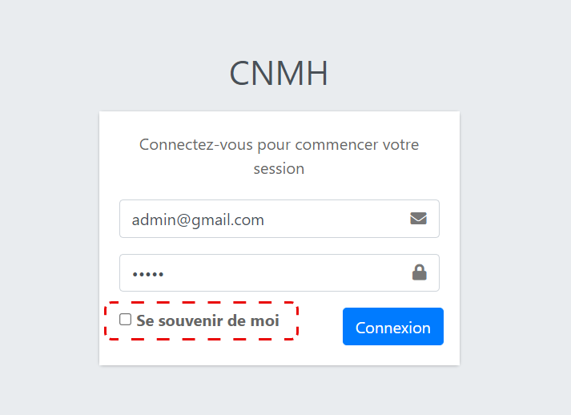

# CNMH test rapport 
## 1.   les fonctionnalités 
- admin connection
- social connection
- medecin connection
- 
## 2.   Problem de resoudre

### admin connection

#### 1. Logo 

- Ce titre `(CNMH)` devrait être supprimé et le logo cnmh ajouté

- Lorsque vous cliquez sur ce bouton, vous serez redirigé vers cette page
   

#### 2. Informations qui apparaissent dans les champs de saisie

Les `input` doivent être vides au début du processus de `login`.

#### 3. Messages d'erreur

Cette message doit être rédigée en français

#### 4. méthode `(de se souvenir de moi)`

Cette méthode ne fonctionne pas.

